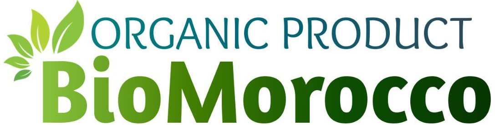

# 🌿 Welcome to BioMorocco 🌿



Welcome to `BioMorocco`, your one-stop destination for `premium organic products in Morocco!` Our mission is to bring you the finest selection of bio products, sourced sustainably and delivered with care. From the rich essence of argan oil to a diverse range of organic goods, we ensure the highest quality and authenticity in every product.

Explore our website and discover the natural goodness that `BioMorocco` has to offer. Whether you're looking for health, beauty, or culinary delights, we've got you covered with products that are good for you and the planet.

`Join us` on this journey towards a healthier, more sustainable lifestyle. `Happy shopping!`

## Features

- `RESTful API` endpoints for managing portfolio data
- `CRUD operations` for projects and other portfolio elements
- User `authentication` and `authorization`
- `Sending emails` for user notifications (sign-up and password recovery, and new Orders and Low stock dedicated)
- Use `JSON` to store a list of image paths as a string in the database. This allows for easy storage and retrieval of multiple image references associated with various objects.
- Integration with `MySQL` for persistent data storage
- `Redis` integration for storing session IDs and password recovery codes with Expiration.
- Containerization with `Docker` for easy deployment
- Multi-container management with `Docker-Compose` for development and testing

## Technologies Used

- **Flask**: Python web framework
- **Flask-RESTful**: Extension for building REST APIs with Flask
- **Redis**: In-memory data structure store for session management
- **MySQL**: Relational database management system
- **SQLAlchemy**: ORM for database interactions
- **smtplib**: Python library for sending email
- **Docker**: Containerization platform
- **Docker-Compose**: Tool for defining and running multi-container Docker applications

## Setup and Installation

### Prerequisites

- Python 3.x
- Docker and Docker-Compose (Optional, but recommended for simplicity)

### Steps

1. **Clone the repository:**

   ```bash
   git clone https://github.com/medwf/BioMorocco.git
   cd BioMorocco
   ```

2. **Set up environment variables:**

   - In `BackEnd/.env`, set the following variables:

     ```env
     # For running with docker-compose:
     MYSQL_HOST=db
     REDIS_HOST=redis

     # For running without docker-compose:
     MYSQL_HOST=localhost
     REDIS_HOST=localhost
     ```

3. **Two ways to start the application:**

   ### Using Docker-Compose (Recommended)

   1. **Build and Start the Containers:**

      - Run the following command to build and start all services:

        ```bash
        docker-compose up --build
        ```

      - This is the best way to start the application as it requires just one command 😍.

      - This command will:
        - Build the Flask backend application.
        - Start the MySQL database with the specified user and database.
        - Start the Redis server.

   2. **Accessing the Application:**

      - Once all services are up and running, the Flask application will be accessible at `http://localhost:5000`.
      - MySQL will be running on port `3306` and Redis on port `6379`.

   3. **Managing Containers:**

      - To stop the containers, run:

        ```bash
        docker-compose stop
        ```

      - To delete all containers, run:

        ```bash
        docker-compose down
        ```

      - To rebuild and start the containers, run:

        ```bash
        docker-compose up --build
        ```

      - To start containers after stopping, run:

        ```bash
        docker-compose start -d
        ```

   ### Manual Setup

   1. **Install all required dependencies:**

      ```bash
      pip install -r requirements.txt
      ```

   2. **Setup MySQL:**

      - Navigate to the `BackEnd` directory and run the following command to set up the MySQL user:

        ```bash
        cat mysql/setup-mysql.sql | sudo mysql -uroot -p
        ```

   3. **Run the application:**

      ```bash
      ./run
      ```

## API Endpoints Documentation

The API endpoint Swagger documentation is available at [http://localhost:5000/api//v1/docs](http://localhost:5000/api/docs).

## About me

**WAFI Mohamed**: [GitHub](https://github.com/medwf/) / [X](https://x.com/medwf95) / [LinkedIn](https://www.linkedin.com/in/mohamed-wafi-a65277273/)
